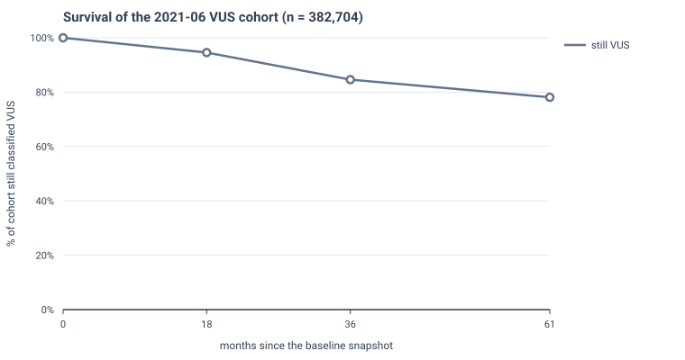
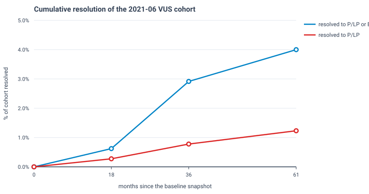

# Fixed-cohort survival curve — the 2021-06 VUS cohort

One cohort, **382,704 variants**, classified *Uncertain significance* with assertion criteria at 2021-06 (GRCh38, deduplicated on `VariationID`, excluding *no assertion criteria provided*). The same variants are then looked up in each later snapshot.

**Why hold the cohort fixed.** The transition analysis in [`transitions.md`](transitions.md) varies the *baseline* and holds the endpoint fixed, so a difference in reclassification rate is confounded with cohort composition — a later baseline contains many recently submitted, less mature variants. Here the denominator never changes across the three time points, so elapsed time is the only thing varying.

## Measured points

| snapshot | months elapsed | still VUS | → P/LP | → B/LB | conflicting | retired/absent |
|---|---|---|---|---|---|---|
| 2022-12 | 18 | 361,875 (94.56%) | 1,058 (0.28%) | 1,335 | 17,710 | 722 |
| 2024-06 | 36 | 323,751 (84.60%) | 2,987 (0.78%) | 8,215 | 46,419 | 1,328 |
| 2026-07 | 61 | 299,725 (78.32%) | 4,735 (1.24%) | 10,631 | 59,298 | 8,285 |

Month 0 is definitional rather than measured: the cohort is 100% VUS at its own baseline by construction. It anchors the curves but is not a data point.

## Evaluation material over time

How much usable benchmark material the cohort has yielded at each date — the hard stratum is missense **and** review status of at least *criteria provided, multiple submitters*.

| months elapsed | → P/LP | distinct genes | hard stratum (missense, ≥2★) |
|---|---|---|---|
| 18 | 1,058 | 444 | 135 |
| 36 | 2,987 | 786 | 550 |
| 61 | 4,735 | 1,100 | 1,577 |

Each figure is the cohort's state *at that date* rather than a cumulative hazard. Over these points the P/LP count happens to increase monotonically, but nothing forces it to: a variant can be reclassified and later disputed.

## Caveats

- The cohort is fixed, so this removes the composition confound between baselines — it does **not** remove ascertainment bias. Variants in well-studied genes still resolve faster.

- Molecular consequence, used for the hard stratum, comes from the current ClinVar VCF `MC` field. Consequence is a property of the variant rather than of the date, so applying it at every time point is intentional.

- Review status is read from each endpoint's own snapshot, so the hard stratum reflects what was true at that date.
